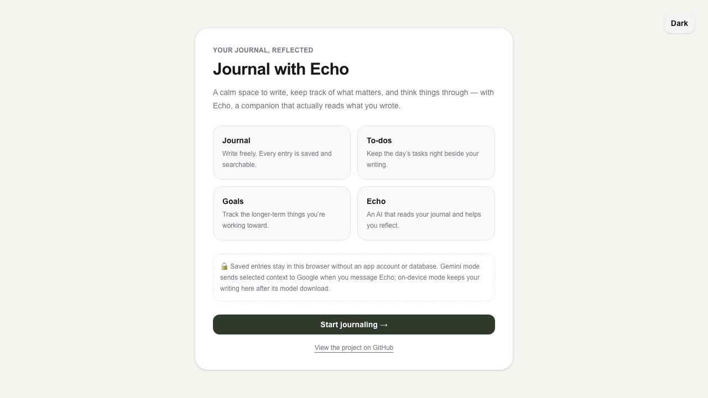

# Journal with Echo

*Your journal, reflected.*

[Open the live demo](https://journalwithecho.netlify.app/) · [View the source on GitHub](https://github.com/Alp-Iskin/Echo)



A browser-based journaling app where saved entries, to-dos, and long-term goals
stay in local storage. Alongside your writing is **Echo**, an AI companion that
can use either Gemini or an on-device model to help you reflect.

## Features

- **Journal** — write entries; search journal titles and entry text.
- **To-dos & Goals** — track day-to-day tasks and longer-term goals beside your writing.
- **Echo (AI companion)** — chat with an assistant that receives a bounded, newest-first selection of your journal, to-dos, goals, and recent conversation as context.
  - **Gemini** (default) — natural, capable replies via a server route that keeps your API key private.
  - **On-device** — WebLLM + WebGPU inference that keeps journal text on the device; the first use downloads model weights, and cached models can run offline afterward.
- **Private by design** — no accounts and no database. Saved data is stored in
  `localStorage`. In Gemini mode, a bounded selection of context is sent to
  Google when you message Echo. On-device mode keeps journal text in the browser
  after its model weights have downloaded.

## How it works

The journal, to-dos, goals, settings, and recent Echo conversation are kept in
the browser with `localStorage`. Persistence effects are hydration-gated: Echo
loads saved state before it permits React's initially empty arrays to be written,
which prevents a reload from replacing existing browser data with empty state.

Choosing Gemini sends a size-limited selection of context through the app's
`/api/echo` server route; the Gemini key never ships to the browser. Choosing
On-device lazily downloads a WebLLM model and runs later responses in the browser
with WebGPU.

## Getting started

```bash
npm install
cp .env.example .env.local   # then add your free key from https://aistudio.google.com/apikey
npm run dev
```

Open http://localhost:3000.

Run all portfolio checks with:

```bash
npm run check
```

The journal and Gemini modes target current desktop browsers on Windows and
macOS. On-device mode additionally needs WebGPU; current Chrome or Edge is the
most reliable choice.

## Engineering details

- **Bounded context:** the prompt packs journal entries newest-first within a character
  budget and lists older entries by title and date. Model history keeps the eight newest
  completed turns and excludes pending or failed responses.
- **Two local model sizes:** on-device mode offers quantized Llama 3.2 1B (~0.9 GB)
  and 3B (~2.0 GB) models. The larger model trades download size and latency for a more
  capable local response.
- **Defensive streaming:** Gemini requests are UTF-8 bounded to 64 KiB. The route checks
  request origin, retries transient upstream failures, and converts Gemini SSE into a
  plain-text stream for the client.
- **Focused verification:** `npm run check` runs ESLint, transport verification, and a
  production build. The transport checks cover ASCII and multibyte request bounds,
  failed-history filtering, zero-token responses, and fragmented UTF-8/SSE boundaries.

## Development note

I started Echo as a journaling and planning project, then expanded it through
iterative, AI-assisted development. I kept the product and architecture small
enough to test and explain: a Next.js interface, browser storage, one server
route for Gemini, and an optional local WebLLM path.

## Deploying (Netlify)

Push to GitHub and import the repo in Netlify — it auto-detects Next.js. Set
`GEMINI_API_KEY` in the site's environment variables, then deploy. The
`/api/echo` route runs as a serverless function so the key stays server-side.

The route includes same-origin checks, a 64 KiB request limit, and a 10-request-per-minute
burst guard for each warm server instance.
That is appropriate for a portfolio demo, but it is not a replacement for
account-based quotas on a high-traffic production service.

## Tech

Next.js 16 · React 19 · Tailwind 4 · Gemini API · `@mlc-ai/web-llm`
